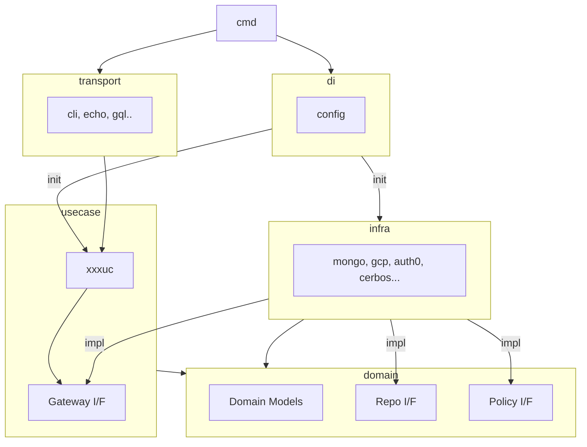

# server-scaffold

This is an example repository for showing the standard module design used in Re:Earth's Go server application.

- **cmd**: Entrypoint
- **internal**
  - **di**: Read the config, initialize DB drivers, etc., and finally initialize usecases and run the appropriate transport layer.
  - **infra**: Implements repos, policies, and gateways.
    - **gcp**
    - **mongo**
    - ...
  - **transport**: UI layer
    - **cli**
    - **echo**
    - **gql**
    - ...
  - **usecase**: Define gateways interfaces
    - **xxxuc** Actual usecase implementation
    - **gateway**: Gateways interfaces (including transaction interfaces)
    - **usecase.go**: Usecase container
    - ...
- **pkg**: Domain models, repo/policy interfaces

## Dependency Flows

